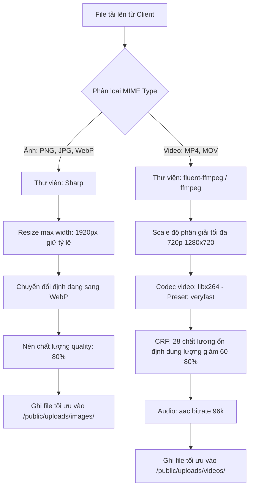
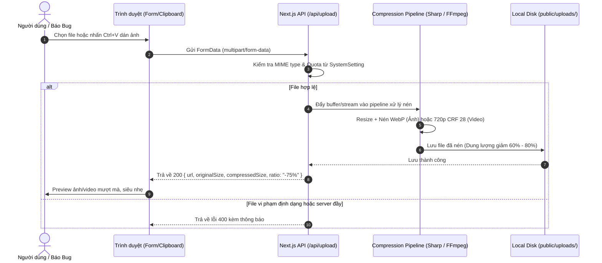

# Module 01: Hệ Thống Lưu Trữ Upload Máy Chủ Nội Bộ (Local Server Storage)

Tài liệu này đặc tả cơ chế upload tệp tin (ảnh, video) trực tiếp vào máy chủ nội bộ trong dự án, kiểm tra định dạng và trang quản trị cấu hình Admin Storage Settings.

---

## 1. Yêu cầu nghiệp vụ & Kỹ thuật

- **Không dùng dịch vụ Cloud bên ngoài:** Toàn bộ ảnh/video chứng cứ báo bug, biên lai học phí hoặc video tái hiện đều được lưu trực tiếp trên ổ đĩa của server tại thư mục: `public/uploads/`.
- **Hỗ trợ đa định dạng:**
  - Ảnh: PNG, JPG/JPEG, WebP, GIF.
  - Video: MP4, MOV (QuickTime), WebM.
- **Cơ chế tải lên:**
  - Tải lên qua kéo thả hoặc nút bấm chọn file.
  - **Dán trực tiếp ảnh từ Clipboard (Ctrl + V)** vào khung mô tả ticket hoặc comment.
- **Quản trị cấu hình linh hoạt (Admin Configurable):** Admin có thể vào trang cài đặt để:
  - Bật / Tắt cho phép upload video.
  - Giới hạn dung lượng tối đa cho 1 ảnh (ví dụ: 5MB, 10MB).
  - Giới hạn dung lượng tối đa cho 1 video (ví dụ: 25MB, 50MB, 100MB).
  - Thêm/bớt danh sách các loại file (MIME types) được phép tải lên.
  - Xem dung lượng đĩa cứng đã dùng so với hạn mức (Quota).

---

## 2. Mô hình dữ liệu & Cấu trúc thư mục đĩa cứng

### 2.1. Cấu trúc thư mục lưu trữ
```text
public/
└── uploads/
    ├── images/
    │   └── YYYY-MM/          # Phân chia theo năm-tháng để tránh quá tải 1 thư mục
    │       └── uuid-filename.png
    └── videos/
        └── YYYY-MM/
            └── uuid-filename.mp4
```

### 2.2. Bảng `SystemSetting` trong Prisma
```prisma
model SystemSetting {
  id                   String   @id @default("default")
  allowedFileTypes     String   @default("image/png,image/jpeg,image/webp,video/mp4,video/quicktime")
  maxImageSizeMb       Int      @default(10)
  maxVideoSizeMb       Int      @default(50)
  allowVideoUpload     Boolean  @default(true)
  storageQuotaGb       Int      @default(20)
  defaultUserPassword  String   @default("10xEnglish@2026")
  updatedAt            DateTime @updatedAt
}
```

---

## 3. Zod Schema Validation

File: `src/lib/validations/setting.schema.ts`
```typescript
import { z } from 'zod';

export const updateStorageSettingSchema = z.object({
  allowedFileTypes: z.string().min(1, 'Vui lòng chọn ít nhất một định dạng tệp tin'),
  maxImageSizeMb: z.number().int().min(1).max(50, 'Dung lượng ảnh tối đa 50MB'),
  maxVideoSizeMb: z.number().int().min(5).max(200, 'Dung lượng video tối đa 200MB'),
  allowVideoUpload: z.boolean(),
  storageQuotaGb: z.number().int().min(1).max(500, 'Hạn mức lưu trữ không vượt quá 500GB'),
});

export const fileUploadValidateSchema = z.object({
  fileName: z.string().min(1),
  fileSize: z.number().positive(),
  mimeType: z.string(),
});
```

---

## 4. Pipeline Nén & Giảm Dung Lượng (Compression Pipeline)

Để tránh tràn bộ nhớ ổ cứng của server khi giáo viên và nhân sự đính kèm ảnh 4K hoặc quay video dài, toàn bộ tệp tin tải lên đều phải đi qua **Pipeline xử lý nén tự động** trước khi lưu vào đĩa cứng:



### 4.1. Code Xử Lý Nén Ảnh (`src/lib/storage.ts` với `sharp`)
```typescript
import sharp from 'sharp';
import path from 'path';
import fs from 'fs/promises';

export async function processAndSaveImage(
  buffer: Buffer,
  targetDir: string,
  fileName: string
): Promise<{ relativePath: string; savedSizeBytes: number }> {
  await fs.mkdir(targetDir, { recursive: true });
  const finalFileName = `${fileName.replace(/\.[^/.]+$/, '')}.webp`;
  const fullPath = path.join(targetDir, finalFileName);

  // Resize tối đa 1920px và nén WebP quality 80
  const compressedBuffer = await sharp(buffer)
    .resize({ width: 1920, height: 1080, fit: 'inside', withoutEnlargement: true })
    .webp({ quality: 80, effort: 4 })
    .toBuffer();

  await fs.writeFile(fullPath, compressedBuffer);

  return {
    relativePath: `/uploads/images/${path.basename(targetDir)}/${finalFileName}`,
    savedSizeBytes: compressedBuffer.length,
  };
}
```

### 4.2. Code Xử Lý Nén Video (`src/lib/video.ts` với `fluent-ffmpeg`)
```typescript
import ffmpeg from 'fluent-ffmpeg';
import path from 'path';

export async function compressVideo(
  inputPath: string,
  outputPath: string
): Promise<{ finalPath: string }> {
  return new Promise((resolve, reject) => {
    ffmpeg(inputPath)
      .output(outputPath)
      .videoCodec('libx264')
      .size('?x720') // Scale chiều cao 720p, chiều rộng tự tính theo tỷ lệ
      .outputOptions([
        '-preset veryfast',
        '-crf 28',         // Mức nén tối ưu cho video mô tả bug
        '-pix_fmt yuv420p',
        '-movflags +faststart' // Hỗ trợ xem ngay không cần tải hết file
      ])
      .audioCodec('aac')
      .audioBitrate('96k')
      .on('end', () => resolve({ finalPath: outputPath }))
      .on('error', (err) => reject(err))
      .run();
  });
}
```

---

## 5. Quy trình xử lý Upload (Upload Workflow)



---

## 5. Thiết kế Giao diện Quản trị Cấu hình (Mantis Style)

Màn hình: `/settings` (Tab Lưu Trữ & Upload):
1. **Thẻ trạng thái bộ nhớ:**
   - Thanh tiến độ dung lượng ổ đĩa đã sử dụng: `4.2 GB / 20 GB (21%)`.
   - Cảnh báo khi dung lượng vượt quá 85%.
2. **Form cấu hình:**
   - Switch Toggle: `Cho phép đính kèm video clip lỗi (MP4/MOV)`.
   - Input Number: `Dung lượng ảnh tối đa cho phép (MB)` - Mặc định 10MB.
   - Input Number: `Dung lượng video tối đa cho phép (MB)` - Mặc định 50MB.
   - Checklist MIME Types được duyệt:
     - `[x] image/png` (Ảnh chụp màn hình tiêu chuẩn)
     - `[x] image/jpeg`
     - `[x] image/webp`
     - `[x] video/mp4` (Clip quay lỗi hệ thống)
     - `[x] video/quicktime` (Clip quay từ macOS/iPhone)
3. **Nút "Lưu Cấu Hình":** Sử dụng Server Action với Zod validate và hiển thị Toast thông báo thành công.

---

## 6. Checklist Kiểm Thử & Triển Khai (DoD)

- [ ] Tạo thư mục `public/uploads/images` và `public/uploads/videos` với quyền ghi đĩa.
- [ ] Route Handler `/api/upload` kiểm tra dung lượng và MIME type từ DB `SystemSetting`.
- [ ] Xử lý dán ảnh từ clipboard trên ô nhập liệu (sự kiện `onPaste`).
- [ ] Đổi tên file bằng `crypto.randomUUID()` để chống trùng lặp và loại bỏ ký tự lạ độc hại.
- [ ] Trang `/settings` cho phép Admin chỉnh sửa cấu hình và có hiệu lực ngay lập tức cho các lần upload tiếp theo.
