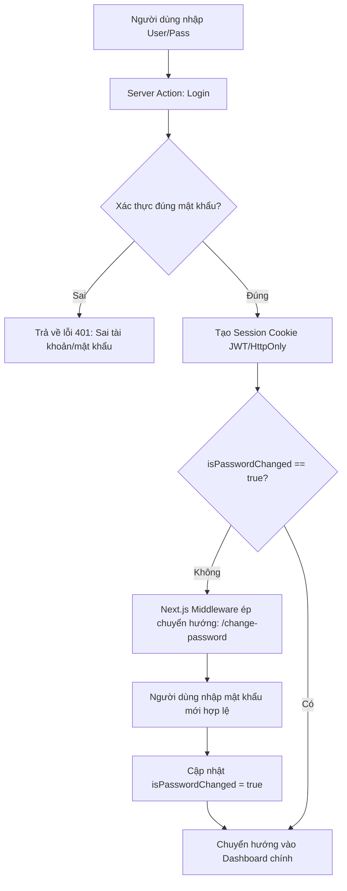

# Module 02: Xác Thực, Phân Quyền (RBAC) & Quản Lý Người Dùng

Tài liệu này đặc tả quy trình đăng nhập, chính sách mật khẩu mặc định, bắt buộc đổi mật khẩu lần đầu và phân quyền người dùng theo phòng ban.

---

## 1. Yêu cầu nghiệp vụ

- **Quản lý theo phòng ban:**
  - Học vụ & Đào tạo (LMS)
  - Tư vấn & Tuyển sinh (CRM)
  - Tài chính & Kế toán
  - Chăm sóc Học viên & Phụ huynh
  - Ban Giám Đốc (BOD)
  - Công nghệ thông tin (IT/Dev)
- **4 Cấp quyền (Roles):**
  1. `DEV_ADMIN`: Quản trị viên cao nhất, toàn quyền cấu hình sprint, sửa trạng thái task, xem mọi log.
  2. `MANAGER`: Sếp / Quản lý điều hành - có đặc quyền bấm nút **"Chấp thuận nghiệm thu"** hoặc **"Yêu cầu sửa lại"** (Sign-off).
  3. `LEAD_STAFF`: Trưởng phòng ban - theo dõi ticket và tiến độ công việc của phòng mình.
  4. `STAFF`: Nhân viên thông thường - tạo ticket báo lỗi, theo dõi phản hồi.
- **Chính sách cấp mật khẩu mặc định:**
  - Khi Admin tạo tài khoản hoặc import hàng loạt từ file Excel, mật khẩu mặc định được tạo là `10xEnglish@2026` (có thể cấu hình trong Admin Setting).
  - Cờ `isPasswordChanged` mặc định là `false`.
- **Cơ chế bắt buộc đổi mật khẩu (Force Change Password):**
  - Khi người dùng đăng nhập bằng mật khẩu mặc định, hệ thống chặn toàn bộ màn hình chức năng và tự động chuyển hướng đến `/change-password`.
  - Chỉ khi đổi mật khẩu mới thành công (`isPasswordChanged = true`), người dùng mới được truy cập Dashboard.
- **Nút "Copy Gửi Zalo":** Cho phép Admin copy nhanh mẫu tin nhắn thông tin tài khoản để gửi cho nhân sự mới qua Zalo/Telegram.

---

## 2. Kiến trúc JWT Authentication (JSON Web Token)

Hệ thống sử dụng thư viện **`jose`** (chuẩn Edge Runtime tương thích 100% với Next.js 16.3.5 App Router và Middleware):

### 2.1. Cấu trúc Payload của JWT Token
```typescript
export interface AuthJWTPayload {
  sub: string;             // User ID (UUID)
  username: string;        // @username
  email: string;           // email@10xenglish.edu.vn
  fullName: string;        // Họ và tên
  role: 'DEV_ADMIN' | 'MANAGER' | 'LEAD_STAFF' | 'STAFF';
  departmentCode?: string; // LMS, CRM, ACC, HR...
  isPasswordChanged: boolean;
  iat: number;             // Thời điểm cấp
  exp: number;             // Hết hạn sau 7 ngày
}
```

### 2.2. Code Tiện Ích Ký & Giải Mã JWT (`src/lib/auth.ts`)
```typescript
import { SignJWT, jwtVerify } from 'jose';
import { cookies } from 'next/headers';
import { AuthJWTPayload } from '@/types/auth';

const JWT_SECRET = new TextEncoder().encode(
  process.env.JWT_SECRET || '10xenglish-cms-ticket-super-secret-key-2026'
);
const COOKIE_NAME = 'cms_session_token';

export async function signJWT(payload: Omit<AuthJWTPayload, 'iat' | 'exp'>): Promise<string> {
  return new SignJWT({ ...payload })
    .setProtectedHeader({ alg: 'HS256' })
    .setIssuedAt()
    .setExpirationTime('7d')
    .sign(JWT_SECRET);
}

export async function verifyJWT(token: string): Promise<AuthJWTPayload | null> {
  try {
    const { payload } = await jwtVerify(JWT_SECRET, token);
    return payload as unknown as AuthJWTPayload;
  } catch {
    return null;
  }
}

export async function setAuthCookie(token: string) {
  const cookieStore = await cookies();
  cookieStore.set(COOKIE_NAME, token, {
    httpOnly: true,
    secure: process.env.NODE_ENV === 'production',
    sameSite: 'lax',
    path: '/',
    maxAge: 60 * 60 * 24 * 7, // 7 ngày
  });
}

export async function clearAuthCookie() {
  const cookieStore = await cookies();
  cookieStore.delete(COOKIE_NAME);
}
```

---

## 3. Zod Validation Schemas

File: `src/lib/validations/auth.schema.ts`
```typescript
import { z } from 'zod';

export const loginSchema = z.object({
  usernameOrEmail: z.string().min(3, 'Tên đăng nhập hoặc email tối thiểu 3 ký tự'),
  password: z.string().min(6, 'Mật khẩu tối thiểu 6 ký tự'),
});

export const changePasswordSchema = z.object({
  currentPassword: z.string().min(1, 'Vui lòng nhập mật khẩu hiện tại'),
  newPassword: z.string()
    .min(8, 'Mật khẩu mới tối thiểu 8 ký tự')
    .regex(/[A-Z]/, 'Mật khẩu phải chứa ít nhất 1 chữ hoa')
    .regex(/[0-9]/, 'Mật khẩu phải chứa ít nhất 1 chữ số'),
  confirmPassword: z.string().min(1, 'Vui lòng nhập lại mật khẩu mới'),
}).refine((data) => data.newPassword === data.confirmPassword, {
  message: 'Mật khẩu xác nhận không khớp',
  path: ['confirmPassword'],
});

export const createUserSchema = z.object({
  fullName: z.string().min(2, 'Họ và tên tối thiểu 2 ký tự'),
  username: z.string().min(3, 'Username tối thiểu 3 ký tự').regex(/^[a-z0-9._]+$/, 'Username chỉ chứa chữ thường, số, dấu chấm'),
  email: z.string().email('Email không đúng định dạng'),
  departmentId: z.string().min(1, 'Vui lòng chọn phòng ban'),
  role: z.enum(['DEV_ADMIN', 'MANAGER', 'LEAD_STAFF', 'STAFF']),
  forceChangePassword: z.boolean().default(true),
});
```

---

## 3. Luồng Kiểm Tra Đăng Nhập & Middleware



---

## 4. Giao diện Quản trị Người Dùng (Mantis Style)

Route: `/users`
- **Bộ lọc & Tìm kiếm:**
  - Ô tìm kiếm text: Tìm theo họ tên, email, username.
  - Dropdown lọc theo phòng ban.
  - Dropdown lọc theo vai trò (Role).
- **Bảng dữ liệu (Users Table):**
  - Cột Avatar + Tên + Email + Username.
  - Cột Phòng ban.
  - Cột Vai trò (Badge màu sắc phân cấp).
  - Cột Mật khẩu mặc định: Hiện nhãn `10xEnglish@2026` nếu chưa đổi, hoặc `Đã đổi mật khẩu riêng`.
  - Cột Trạng thái: `Chưa đăng nhập` (Màu vàng) hoặc `Đã kích hoạt` (Màu xanh).
  - Nút Hành động:
    - **"Gửi Zalo"**: Tự động sinh văn bản và copy vào clipboard.
    - **"Reset Pass"**: Reset mật khẩu tài khoản về lại giá trị mặc định khi nhân viên quên mật khẩu.
    - **"Sửa"**: Mở modal cập nhật quyền/phòng ban.
- **Modal "Tạo Tài Khoản Mới":**
  - Form Zod validation với đầy đủ các trường: Họ tên, Username, Email, Phòng ban, Role.

---

## 5. Checklist Kiểm Thử & Triển Khai (DoD)

- [ ] Tạo seed tài khoản mẫu: 1 Dev/Admin, 1 Sếp/CEO, các nhân viên phòng ban.
- [ ] Middleware kiểm tra `isPasswordChanged`, chặn không cho vào Dashboard nếu chưa đổi pass.
- [ ] Mật khẩu được hash bằng `bcrypt` trước khi lưu vào database.
- [ ] Tính năng copy văn bản gửi Zalo hoạt động mượt mà trên trình duyệt.
- [ ] Nút Reset Password cập nhật lại cờ `isPasswordChanged = false` và hash mật khẩu mặc định.
