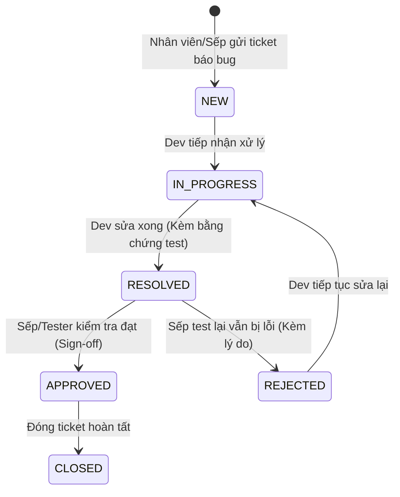

# Module 04: Quản Lý Ticket Báo Bug Chuẩn Hóa (Bug Tracking)

Tài liệu này đặc tả quy trình tạo và xử lý Ticket lỗi mà không qua BA, khắc phục triệt để tình trạng "mô tả lỗi chung chung", tích hợp paste ảnh trực tiếp và luồng trao đổi.

---

## 1. Yêu cầu nghiệp vụ & Form Chuẩn Hóa

### 1.1. Các vấn đề cần giải quyết
1. Nhân viên hoặc Sếp báo lỗi chung chung qua tin nhắn: *"Lỗi rồi em ơi, xem lại hộ anh"*.
2. Không rõ lỗi xảy ra ở dự án nào (LMS hay CRM), màn hình nào và tài khoản ai đang dùng.
3. Không có bằng chứng ảnh chụp màn hình hoặc các bước thao tác để dev tái hiện.

### 1.2. Các trường dữ liệu bắt buộc trên Form
- **Dự án (Project Scope):** Bắt buộc chọn `Project 1 (LMS Học Vụ)` hoặc `Project 2 (CRM Vận Hành)`.
- **Tiêu đề lỗi (Title):** Ngắn gọn, tóm tắt sự cố (VD: *"Bấm nút Điểm danh bị timeout lúc 18h tối"*).
- **Phân hệ con (Sub-module):** Dropdown động thay đổi theo Project đã chọn.
- **Tài khoản gặp lỗi (Affected Role):** Giáo viên, Học viên/Phụ huynh, Tư vấn viên, Kế toán, Admin.
- **Mức độ nghiêm trọng (Severity):**
  - 🔴 `BLOCKER`: Dừng hệ thống, lớp học không điểm danh được, phụ huynh không thanh toán được.
  - 🟠 `HIGH`: Lỗi tính năng quan trọng nhưng còn cách xử lý tạm thời.
  - 🟡 `MEDIUM`: Lỗi logic hiển thị hoặc trải nghiệm người dùng.
  - 🟢 `LOW`: Lệch nút bấm, sai font chữ, màu sắc.
- **Các bước tái hiện (Steps to Reproduce):** Textarea hướng dẫn nhập step-by-step: 1... 2... 3...
- **Bằng chứng đính kèm (Evidence):** Cho phép kéo thả file hoặc **Ctrl + V dán ảnh trực tiếp từ clipboard**.

---

## 2. Zod Schema Validation

File: `src/lib/validations/ticket.schema.ts`
```typescript
import { z } from 'zod';

export const createTicketSchema = z.object({
  projectId: z.string().min(1, 'Vui lòng chọn Dự án (LMS hoặc CRM)'),
  title: z.string().min(6, 'Tiêu đề lỗi tối thiểu 6 ký tự').max(200),
  submodule: z.string().min(1, 'Vui lòng chọn phân hệ con'),
  affectedRole: z.string().min(1, 'Vui lòng chọn tài khoản gặp lỗi'),
  severity: z.enum(['BLOCKER', 'HIGH', 'MEDIUM', 'LOW']),
  description: z.string().min(10, 'Vui lòng mô tả ít nhất 10 ký tự về các bước tái hiện lỗi'),
  evidenceUrls: z.array(z.string().url()).optional().default([]),
});

export const updateTicketStatusSchema = z.object({
  ticketId: z.string().uuid(),
  status: z.enum(['NEW', 'IN_PROGRESS', 'RESOLVED', 'APPROVED', 'CLOSED', 'REJECTED']),
  note: z.string().optional(),
});

export const addCommentSchema = z.object({
  ticketId: z.string().uuid(),
  content: z.string().min(1, 'Nội dung bình luận không được để trống'),
  attachments: z.array(z.string()).optional().default([]),
});
```

---

## 3. Vòng đời Trạng thái Ticket (State Machine)



---

## 4. Giao diện & Trải nghiệm Người Dùng (Mantis Style)

Route: `/tickets`

### 4.1. Bảng danh sách Ticket (Ticket Table)
- Bộ lọc phía trên:
  - Ô tìm kiếm từ khóa (mã ticket `#TK-xxx`, tiêu đề).
  - Lọc theo phân hệ con.
  - Lọc theo mức độ nghiêm trọng (`Blocker`, `High`,...).
  - Lọc theo trạng thái.
- Các cột hiển thị:
  - **Mã:** Dạng `#TK-108` màu indigo nổi bật.
  - **Tiêu đề & Mô tả ngắn.**
  - **Dự án & Phân hệ.**
  - **Tài khoản lỗi.**
  - **Độ nghiêm trọng (Badge màu chuẩn).**
  - **Trạng thái:** Có icon trạng thái (đang quay animate cho `IN_PROGRESS`).
  - **Bằng chứng:** Số lượng ảnh/video đính kèm.
  - **Thao tác:** Nút xem chi tiết.

### 4.2. Modal Chi tiết Ticket & Trao đổi (Detail & Comment Thread)
- Cột bên trái: Chi tiết thông tin lỗi, các bước tái hiện và thư viện ảnh/video bằng chứng (click mở xem phóng to).
- Cột bên phải:
  - Luồng bình luận trao đổi giữa Dev và người báo lỗi.
  - Ô nhập bình luận hỗ trợ gõ text và dán ảnh clipboard.
  - Lịch sử thay đổi trạng thái (Audit timeline: Ai đổi, chuyển sang trạng thái gì, lúc mấy giờ).

---

## 5. Checklist Kiểm Thử & Triển Khai (DoD)

- [ ] Tự động sinh mã `ticketNumber` tăng dần dạng số nguyên dễ đọc (`#TK-101`, `#TK-102`).
- [ ] Dropdown phân hệ con thay đổi tương ứng theo giá trị của Project Scope (LMS vs CRM).
- [ ] Sự kiện `onPaste` cho phép chụp ảnh màn hình (phím PrtScn hoặc Cmd+Shift+4) rồi dán trực tiếp vào form, tự động upload vào `/public/uploads/images/` và hiển thị preview.
- [ ] Không thể chuyển trạng thái sang `APPROVED` nếu không có quyền `MANAGER` hoặc `DEV_ADMIN`.
- [ ] Lưu vết vào bảng `AuditLog` mỗi khi có người thay đổi trạng thái ticket.
