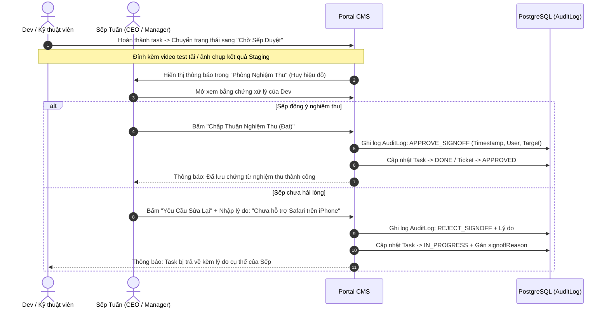

# Module 06: Phòng Nghiệm Thu Của Sếp & Lưu Vết (Sign-Off & Audit Trail)

Tài liệu này đặc tả cơ chế nghiệm thu UAT trực tiếp giữa Dev và Sếp/Quản lý, chống tình trạng "sếp đổi ý không lưu vết" hoặc tranh cãi về kết quả công việc.

---

## 1. Yêu cầu nghiệp vụ cốt lõi

### 1.1. Bối cảnh & Rủi ro thực tế
- Khi Dev làm xong tính năng hoặc sửa xong Bug, Sếp thường kiểm tra qua loa hoặc nhắn qua Zalo: *"OK em"*, nhưng vài hôm sau lại bảo: *"Anh chưa thấy em làm cái này"* hoặc *"Sao hôm trước em làm khác bây giờ"*.
- Cần một quy trình số hóa ràng buộc trách nhiệm: **Sign-off Protocol**.

### 1.2. Quy tắc Nghiệm thu (Sign-off Rules)
1. **Chỉ tài khoản có Role `MANAGER` hoặc `DEV_ADMIN` mới có quyền ký duyệt nghiệm thu.**
2. **Quyết định 2 nút bấm rõ ràng:**
   - Nút 1: **"Chấp Thuận Nghiệm Thu (Đạt)"** ➔ Trạng thái task chuyển thành `DONE`, ticket chuyển thành `APPROVED`. Hệ thống ghi nhận dấu mốc hoàn thành.
   - Nút 2: **"Yêu Cầu Sửa Lại"** ➔ Bắt buộc phải nhập lý do cụ thể vào ô text. Trạng thái task quay lại `IN_PROGRESS` (kèm cờ `signoffReason`), thông báo Dev sửa tiếp.
3. **Lưu vết vĩnh viễn (Audit Trail):** Mọi hành động duyệt/từ chối đều ghi log timestamp, IP và họ tên người duyệt vào bảng `AuditLog`, không có chức năng xóa hoặc chỉnh sửa log.

---

## 2. Zod Schema Validation

File: `src/lib/validations/signoff.schema.ts`
```typescript
import { z } from 'zod';

export const signOffApproveSchema = z.object({
  targetType: z.enum(['TICKET', 'TASK']),
  targetId: z.string().uuid(),
  notes: z.string().optional(),
});

export const signOffRejectSchema = z.object({
  targetType: z.enum(['TICKET', 'TASK']),
  targetId: z.string().uuid(),
  rejectionReason: z.string().min(8, 'Vui lòng nhập lý do từ chối nghiệm thu ít nhất 8 ký tự để Dev có căn cứ sửa lại'),
});
```

---

## 3. Luồng Xử Lý Nghiệm Thu (Sign-off Workflow)



---

## 4. Thiết kế Giao diện Phòng Nghiệm Thu (Mantis Style)

Route: `/approval`

### 4.1. Khung cảnh báo nguyên tắc UAT
- Banner trên cùng màu hổ phách:
  > *"Cơ Chế Nghiệm Thu Chống Đổi Ý: Khi Dev đã hoàn tất tính năng hoặc sửa xong Bug, Sếp bấm trực tiếp 'Chấp thuận' hoặc 'Yêu cầu sửa lại'. Toàn bộ quyết định được lưu vĩnh viễn làm cơ sở báo cáo ban giám đốc."*

### 4.2. Thẻ Nghiệm Thu Chi Tiết (Sign-off Card)
- **Header Thẻ:**
  - Mã task / ticket: `#TK-108 • BLOCKER BUG` hoặc `#FT-204 • TÍNH NĂNG MỚI`.
  - Huy hiệu: `Chờ Sếp Duyệt`.
- **Nội dung báo cáo kết quả của Dev:**
  - Hộp thông tin tóm tắt: Dev đã sửa gì trong database, đã viết lại query nào, đã test tải bao nhiêu user.
  - Link đính kèm: *"Xem video test tải nghiệm thu (1m20s)"*, *"Mở link Staging test trực tiếp"*.
- **Khu vực quyết định của Sếp:**
  - Nút Xanh lá lớn: **`✓ Chấp Thuận Nghiệm Thu (Đạt)`**.
  - Nút Viền Đỏ: **`✕ Yêu Cầu Sửa Lại`** (Click mở hộp thoại nhập lý do).

### 4.3. Bảng Lịch Sử Nghiệm Thu (Audit Trail Table)
- Danh sách các hạng mục Sếp đã ký duyệt gần đây:
  - Tên task / bug.
  - Người duyệt: Sếp Tuấn (CEO).
  - Ngày giờ duyệt chính xác từng phút.
  - Trạng thái nghiệm thu: `Đạt` hoặc `Từ chối (kèm lý do)`.

---

## 5. Checklist Kiểm Thử & Triển Khai (DoD)

- [ ] Chỉ user có role `MANAGER` hoặc `DEV_ADMIN` mới nhìn thấy nút bấm Duyệt / Từ chối.
- [ ] Khi Sếp bấm từ chối, bắt buộc validate độ dài lý do bằng Zod trước khi lưu.
- [ ] Không ai (kể cả Dev Admin) có API xóa hoặc sửa bảng `AuditLog`.
- [ ] Bảng lịch sử nghiệm thu hiển thị dữ liệu real-time theo thứ tự mới nhất lên đầu.
