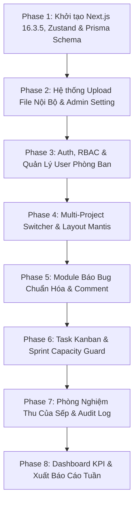

# Hướng Dẫn & Lộ Trình Triển Khai Kỹ Thuật (AI Implementation Roadmap)

Tài liệu này là chỉ dẫn thứ tự ưu tiên từng bước dành cho AI hoặc lập trình viên khi bắt tay vào code dự án CMS Ticket & Task Portal. 

> [!IMPORTANT]
> **Nguyên tắc triển khai:**
> 1. Triển khai tuần tự từ Phase 1 đến Phase 8.
> 2. Luôn hoàn thành Prisma Schema và Zod validation trước khi dựng UI.
> 3. Kiểm tra xong tiêu chí hoàn thành (DoD) của Phase hiện tại mới chuyển sang Phase kế tiếp.

---

## 1. Bản đồ Tài liệu Đặc tả (Documentation Map)

| STT | Tên tài liệu | Nội dung chi tiết | File đặc tả |
| :---: | :--- | :--- | :--- |
| **00** | **Kiến Trúc & Tech Stack** | Next.js 16.3.5 App Router, PostgreSQL, Prisma Schema, Mantis Theme, Zustand State, Zod standard | [`00-architecture-and-techstack.md`](./00-architecture-and-techstack.md) |
| **01** | **Upload & Local Storage** | Lưu trữ ảnh/video vào server nội bộ, bảng `SystemSetting`, trang Admin cấu hình dung lượng | [`01-upload-and-storage-system.md`](./01-upload-and-storage-system.md) |
| **02** | **Auth & User Management** | Đăng nhập, RBAC 4 quyền, 5 phòng ban, pass mặc định `10xEnglish@2026`, bắt buộc đổi pass | [`02-auth-rbac-and-user-management.md`](./02-auth-rbac-and-user-management.md) |
| **03** | **Multi-Project Scope** | Phân tách 2 Project chính (LMS vs CRM), bộ chọn `Project Switcher` toàn cục với Zustand Store | [`03-project-scope-and-switcher.md`](./03-project-scope-and-switcher.md) |
| **04** | **Bug Tracking Module** | Form báo bug chuẩn hóa theo Project, paste ảnh clipboard, trao đổi comment, audit trail | [`04-bug-ticket-module.md`](./04-bug-ticket-module.md) |
| **05** | **Task Kanban & Sprint** | Kanban 4 cột, task kế hoạch vs đột xuất của Sếp, Sprint Capacity Guard (bù trừ task) | [`05-task-kanban-and-sprint.md`](./05-task-kanban-and-sprint.md) |
| **06** | **Phòng Nghiệm Thu Sếp** | Sign-off protocol: Chấp thuận / Từ chối (bắt buộc lý do), lưu vết vĩnh viễn không thể xóa | [`06-signoff-and-boss-approval.md`](./06-signoff-and-boss-approval.md) |
| **07** | **Dashboard & Báo Cáo** | KPI sprint, biểu đồ phân hệ, xuất báo cáo PDF gửi Sếp trước cuộc họp tuần | [`07-dashboard-and-executive-report.md`](./07-dashboard-and-executive-report.md) |

---

## 2. Thứ tự 8 Giai đoạn Triển khai (Phase-by-Phase Execution)

---

### Phase 1: Nền Tảng Kỹ Thuật, Prisma Database, Zustand, Morphicons & Mantis Layout
- [ ] Khởi tạo dự án Next.js 16.3.5 App Router với Tailwind CSS.
- [ ] Cài đặt các thư viện lõi: `npm install zustand morphicons jose bcryptjs`.
- [ ] Tạo thư mục `src/stores/` cho Zustand stores.
- [ ] Cấu hình Prisma với PostgreSQL, copy schema từ `00-architecture-and-techstack.md`.
- [ ] Tạo file seed (`prisma/seed.ts`) khởi tạo 2 Project (`LMS`, `CRM`), 5 phòng ban mẫu, và cấu hình `SystemSetting`.
- [ ] Dựng khung Layout chuẩn Mantis Dashboard: Sidebar thu phóng điều khiển qua Zustand `useUIStore`, Top Header, breadcrumbs, sử dụng icons từ `morphicons`.

### Phase 2: Upload File Nội Bộ, Pipeline Nén & Trang Quản Trị Cấu Hình
- [ ] Cài đặt thư viện xử lý nén media: `npm install sharp fluent-ffmpeg` (kèm `@types/fluent-ffmpeg`).
- [ ] Tạo thư mục `public/uploads/images` và `public/uploads/videos`.
- [ ] Xây dựng Pipeline nén ảnh tự động bằng `sharp`: Resize max width 1920px, convert WebP quality 80% (giảm 70% dung lượng đĩa).
- [ ] Xây dựng Pipeline nén video tự động bằng `fluent-ffmpeg`: Scale 720p, codec x264 CRF 28 (giảm 60-80% dung lượng).
- [ ] Xây dựng Route Handler `/api/upload` đọc cấu hình `SystemSetting` trong DB để chặn file vượt dung lượng hoặc sai MIME type.
- [ ] Xây dựng trang Admin `/settings` cho phép điều chỉnh dung lượng tối đa (MB), danh sách đuôi file và bật/tắt video.

### Phase 3: Xác Thực JWT, Phân Quyền & Quản Trị Người Dùng
- [ ] Viết module JWT tiện ích `src/lib/auth.ts` sử dụng `jose` để ký (sign) và giải mã (verify) token lưu trong HttpOnly Cookie.
- [ ] Xây dựng trang Đăng nhập (`/login`) với Zod validation, cấp JWT token khi đăng nhập thành công.
- [ ] Tạo tài khoản mặc định kèm pass `10xEnglish@2026`.
- [ ] Viết Next.js Middleware giải mã JWT token, kiểm tra payload `isPasswordChanged = false` và ép chuyển hướng đến `/change-password`.
- [ ] Dựng trang Quản lý tài khoản (`/users`): Bảng danh sách, nút Reset Pass, nút copy thông tin gửi Zalo, modal tạo user mới.

### Phase 4: Bộ Chọn Đa Dự Án (Project Switcher)
- [ ] Tạo Component `ProjectSwitcher` trên Top Navbar (Lựa chọn giữa `ALL`, `LMS`, `CRM`).
- [ ] Lưu trữ trạng thái vào Cookie `active_project` và kích hoạt làm mới trang.
- [ ] Tạo Custom Hook `useProject()` để các trang con đọc context đang active.

### Phase 5: Quản Lý Ticket Báo Bug Chuẩn Hóa
- [ ] Viết Zod Schema `createTicketSchema` kiểm tra các trường bắt buộc.
- [ ] Dựng Form báo bug: Radio card chọn Project (LMS vs CRM), dropdown phân hệ con động, chọn độ nghiêm trọng.
- [ ] Xử lý sự kiện `onPaste` cho phép dán ảnh chụp màn hình từ clipboard trực tiếp vào form.
- [ ] Dựng Bảng Ticket (`/tickets`) kèm bộ lọc đa tiêu chí và modal chi tiết ticket có khung bình luận.

### Phase 6: Kanban Task Hàng Ngày & Sprint Capacity Guard
- [ ] Dựng bảng Kanban 4 cột (`To Do`, `In Progress`, `Pending Approval`, `Done`).
- [ ] Phân loại rõ task kế hoạch vs task phát sinh đột xuất của Sếp (`⚡ ĐỘT XUẤT`).
- [ ] Thêm sub-tasks checklist trong từng task card có thể tick hoàn thành.
- [ ] Xây dựng cơ chế **Sprint Capacity Guard**: Khi Sếp thêm việc chen ngang vượt định mức, mở modal bắt buộc chọn 1 task tương đương để đẩy sang sprint sau.

### Phase 7: Phòng Nghiệm Thu Của Sếp (Sign-off Room)
- [ ] Dựng trang `/approval` chỉ hiển thị các task/ticket đang ở trạng thái chờ duyệt.
- [ ] Nút **"Chấp Thuận Nghiệm Thu (Đạt)"**: Chuyển trạng thái sang `DONE`/`APPROVED` và ghi log.
- [ ] Nút **"Yêu Cầu Sửa Lại"**: Mở form bắt buộc nhập lý do từ chối trước khi chuyển ngược về `IN_PROGRESS`.
- [ ] Bảng Audit Log lưu vết không thể chỉnh sửa hoặc xóa.

### Phase 8: Dashboard Chỉ Số & Xuất Báo Cáo
- [ ] Dựng 4 thẻ chỉ số KPI trên trang chủ `/`: Bug tồn đọng, tiến độ Sprint, thời gian fix TB, việc chờ nghiệm thu.
- [ ] Biểu đồ thanh ngang tiến độ theo từng phân hệ.
- [ ] Tính năng xuất file PDF hoặc tạo link tóm tắt gửi Sếp trước cuộc họp giao ban tuần.
